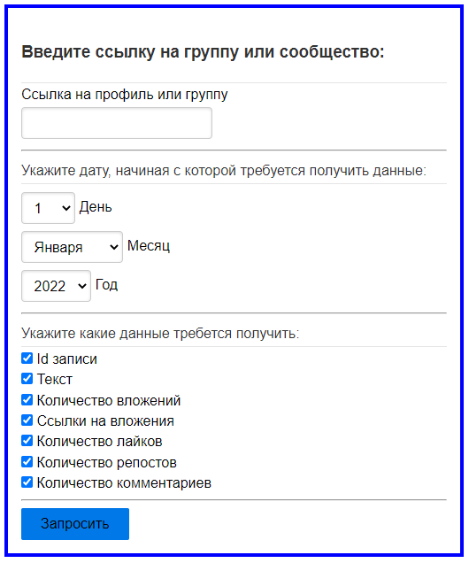
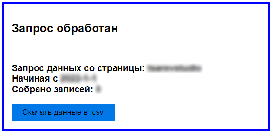

# Парсинг записей со стены пользователя или сообщества VK

Приложение позволяет по ссылке на профиль пользователя / сообщества и дате начала поиска скачать информацию о записях на стене в csv формате.


В зависимости от выбранных опций, в итоговый файл могут быть записаны следующие данные:
- id записи
- текст записи
- количество лайков
- количество репостов
- количество комментариев
- количество вложений
- ссылки на вложения (при их наличии)

Кодировка итогового файла - UTF-8.

## Установка 
Склонируйте репозиторий проекта.
```bash
git clone https://github.com/Mikhail-Tsarev/vk_parsing_app.git
cd vk_parsing_app
```

## Настройка
Вставьте свой VK API access_token в файл [app/.env](app/.env).
Требуется access_token пользователя с возможностью offline доступа.
Как получить VK API access_token можно прочитать здесь [документация VK](https://dev.vk.com/api/access-token/getting-started)

```bash
cp ./app/.env.exmample ./app/.env
```

При необходимости измените значение констант DEBAG (включение/выключение режима отладки) и SERET_KEY (защитный код Flask приложения) в файле [app/config.py](app/config.py) 
```python
DEBAG = False
SECRET_KEY = ""
```
## Запуск
### Локальный запуск
Точка входа в приложение - файл [run.py](app/run.py) из папки app.
```bash
python ./app/run.py
```

После запуска откройте браузер и перейдите по адресу [http://localhost:5000](http://localhost:5000) или [http://127.0.0.1:5000](http://127.0.0.1:5000).

Для остановки приложения нажмите CTRL+C в терминале.
### Запуск через Docker:
Установите приложения Docker и Docker Compose.
Находясь в корне проекта в терминале введите команду:

```python
cd app
docker-compose up
```
Для остановки приложения нажмите CTRL+C в терминале.

*(На текущий момент работа через Docker не отлажена: сервер с приложением поднимается, но приложение не видит views.py, что не позволяет отразить содержимое страницы в браузере)*

## Работа с приложением
1. Введите ссылку на профиль пользователя или страницу сообщества. 

   *Примеры корректных сслылок:*
   - https://vk.com/marinkaapelsinka
   - vk.com/marinkaapelsinka
   - marinkaapelsinka
   - https://vk.com/id111111
   - vk.com/id111111
   - id111111
   
*Примечание: работа с профилями и сообществами, доступ к которым ограничен настройками приватности не поддерживается api сайта VK. В случае ввода ссылки на закрытый профиль, будет отображено сообщение об ошибке доступа.*

3. Введите дату, начиная с которой требуется собрать данные.

*Примечание: в случае ввода некорректной даты (например, 31 февраля), будет отображено сообщение о несоответствии числа и месяца*

4. При необходимости снимите галочки с нежелательных полей. Эти данные не попадут в итоговый файл.
5. Нажмите кнопку "Запросить" 
6. Приложение начнет сбор данных. Процедура может занять некоторое время, после чего вы будете переадресованы на страницу результатов.
7. Нажмите кнопку "Скачать данные в .csv" для сохранения csv файла. Кодировка итогового файла - UTF-8


## Интерфейс приложения
#### Главная страница

#### Страница результатов

